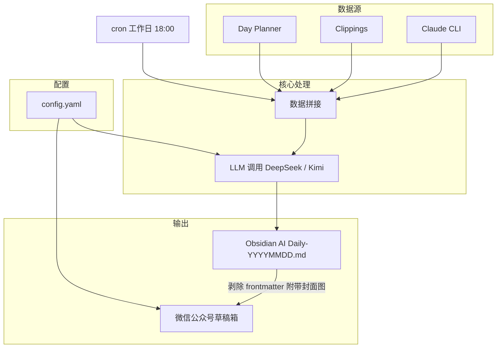

# AI Daily Summary

每天下班时，你的 AI 复盘报告已经写好了。

每个工作日 18:00 自动触发，从 Day Planner、Clippings、Claude CLI 对话三个数据源抓取当天内容，调用 LLM 提炼问题解答、学习收获与工作总结，生成结构化 Markdown 写入 Obsidian，并一键发布到微信公众号草稿箱——无需手动整理，无需打开编辑器，知识沉淀全自动完成。

## 架构概览



## 数据源

| 数据源 | 路径 | 筛选方式 |
|--------|------|----------|
| Day Planner | `{vault}/Day Planners/YYYY-MM-DD.md` | 按日期拼接文件名 |
| Clippings | `{vault}/Clippings/*.md` | 按文件创建日期（birthtime）筛选 |
| Claude CLI | `~/.claude/projects/**/*.jsonl` | 文件 mtime 粗过滤 + 消息 timestamp 精确匹配 |

## 快速开始

```bash
# 1. 安装 Python 依赖并配置 crontab
bash setup.sh

# 2. 安装 baoyu-skills（封面图 + 微信发布）
npx skills add jimliu/baoyu-skills

# 3. 复制配置文件并填入 API key
cp config.yaml.example config.yaml
vim config.yaml

# 4. 手动测试
python3 ai_daily_summary.py

# 5. 指定日期运行
python3 ai_daily_summary.py 20260402
```

## 配置说明（config.yaml）

| 字段 | 说明 |
|------|------|
| `llm_provider` | `deepseek` 或 `kimi` |
| `llm.deepseek.api_key` | DeepSeek API key |
| `llm.kimi.api_key` | Kimi API key |
| `vault` | Obsidian Vault 根目录 |
| `output_dir` | 输出目录，默认 `{vault}/AI Daily` |
| `max_input_chars` | 输入内容最大字符数，默认 60000 |
| `wechat.enabled` | 是否启用微信发布 |
| `wechat.theme` | 文章主题：`default` / `grace` / `simple` / `modern` |
| `wechat.cover` | 静态封面图路径 |

## 执行流程

```
cron 18:00
  → 收集 Day Planner + Clippings + Claude CLI 对话
  → 调用 LLM 生成总结
  → 写入 Obsidian：AI Daily/AI Daily-YYYYMMDD.md
  → bun wechat-api.ts（剥除 frontmatter，附带静态封面图）
      → 发布草稿到微信公众号
```

## 输出文件

```
/Users/shenni/obsidian/AI Daily/
├── AI Daily-YYYYMMDD.md     # 当天总结
└── assets/
    └── cover-YYYYMMDD.png   # 当天封面图
```

文章格式：

```markdown
---
date: 2026-04-03
type: ai-daily-summary
sources:
    day_planner: 1234 字符
    clippings: 5678 字符
    claude_cli: 9012 字符
generated_at: 2026-04-03 18:05:23
---

# 📅 AI Daily Summary - 2026-04-03

（LLM 生成内容）
```

## 文件结构

```
auto-report-daily/
├── ai_daily_summary.py   # 主脚本
├── config.yaml            # 配置文件（需填入 API key）
├── setup.sh               # 安装脚本
├── assets/
│   └── default-cover.png  # 微信发布静态封面图（需手动放置）
├── ai_daily.log           # 运行日志（自动生成）
└── cron.log               # cron 输出日志（自动生成）
```

## 微信公众号配置

API 凭据存储于 `~/.baoyu-skills/.env`：

```bash
WECHAT_APP_ID=your_app_id
WECHAT_APP_SECRET=your_app_secret
```

获取方式：登录[微信公众平台](https://mp.weixin.qq.com) → 设置与开发 → 基本配置。

发布结果为**草稿**，需在公众号后台「内容管理 → 草稿箱」手动发布。

## 定时任务管理

**开启**（重新运行安装脚本）：
```bash
bash /Users/shenni/repository/auto-report-daily/setup.sh
```

setup.sh 会自动探测 `python3` 和 `npx` 的绝对路径，并在 crontab 头部写入正确的 PATH，无需手动调整。

**关闭**（彻底删除）：
```bash
crontab -l | grep -v ai_daily_summary | crontab -
```

**临时禁用 / 重新启用**：
```bash
crontab -e   # 在任务行前加 # 注释禁用，删除 # 重新启用
```

**验证当前状态**：
```bash
crontab -l
```

### 模拟 cron 环境测试

如需在不等待定时触发的情况下验证脚本是否能在 cron 环境正常运行（setup.sh 已自动写入正确 PATH，此命令用于手动排查）：

```bash
PYTHON3="$(which python3)"
NPX_DIR="$(dirname "$(which npx)")"
env -i HOME="$HOME" LOGNAME="$LOGNAME" USER="$USER" \
  PATH="/usr/local/bin:/usr/bin:/bin:/usr/sbin:/sbin:$NPX_DIR" \
  /bin/sh -c "cd \"/Users/shenni/repository/auto-report-daily\" && \
  $PYTHON3 \"/Users/shenni/repository/auto-report-daily/ai_daily_summary.py\" \$(date +%Y%m%d)"
```

这会用与 cron 完全一致的环境变量运行脚本，是排查定时任务不执行问题的首选方式。

**查看执行日志**：
```bash
# 查看实时日志（滚动追踪）
tail -f /Users/shenni/repository/auto-report-daily/cron.log

# 查看最近 50 行
tail -50 /Users/shenni/repository/auto-report-daily/cron.log

# 查看详细运行日志（含各步骤 DEBUG 信息）
tail -f /Users/shenni/repository/auto-report-daily/ai_daily.log
```

| 日志文件 | 说明 |
|----------|------|
| `cron.log` | cron 触发时的原始输出（INFO 级别），确认每次是否成功运行 |
| `ai_daily.log` | 程序内部详细日志，排查数据源读取、LLM 调用、微信发布等各步骤问题 |

## 注意事项

- cron 需要「完全磁盘访问权限」才能读取 Obsidian 文件：  
  **系统设置 → 隐私与安全性 → 完全磁盘访问权限 → 添加 `/usr/sbin/cron`**
- 封面图生成失败不阻断发布流程（无封面继续发布）
- 微信发布失败不影响 Obsidian 文件写入
- 同一天重复执行会覆盖输出文件（幂等安全）
